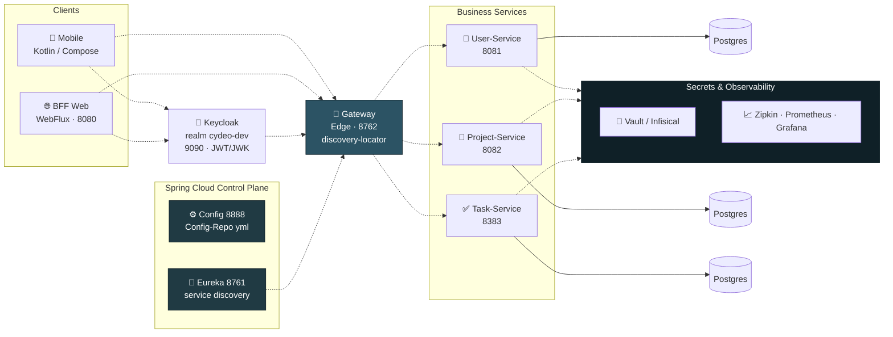

 

 

## About

**TaskFlow** is a project-based task management system, rebuilt from the ground up as a distributed system. It's the "after" to [`ticketing-project-data`](https://github.com/berat-erkul/ticketing-project-data)'s "before" — the same product, this time split into independently deployable services, each owning its own database, wired together with service discovery, centralized configuration, an API gateway, and OAuth2 authentication.

Web and native mobile clients talk to the same backend through a single edge; every business service can be built, deployed, and scaled on its own.

 

## Architecture

Each service is versioned in its own repository (linked below); this repo hosts the system overview and documentation.

**Layers:**

- **Clients** — a native mobile app built with Kotlin/Compose, and a Spring WebFlux-based BFF (Backend-for-Frontend) web layer.
- **Authentication** — Keycloak handles OAuth2 with JWT/JWK; both clients authenticate against the same realm.
- **Edge / Gateway** — Spring Cloud Gateway routes requests dynamically via Eureka's `discovery-locator` — no hardcoded service addresses.
- **Control plane** — Config Server distributes centralized `.yml` configuration, Eureka handles service registration and discovery.
- **Business services** — User, Project, and Task services are fully independent, each with its own PostgreSQL database (database-per-service).
- **Secrets & observability** — Vault/Infisical manage runtime secrets; Zipkin, Prometheus, and Grafana cover distributed tracing and metrics.

 

## Service Repositories

| Service | Description | Repo |
| --- | --- | --- |
| config-service | Centralized configuration server | [config-service-LAB](https://github.com/berat-erkul/config-service-LAB) |
| discovery-service | Eureka service discovery | [discovery-service-LAB](https://github.com/berat-erkul/discovery-service-LAB) |
| gateway-service | Spring Cloud Gateway (edge) | [gateway-service-LAB](https://github.com/berat-erkul/gateway-service-LAB) |
| user-service | User management | [user-service-LAB](https://github.com/berat-erkul/user-service-LAB) |
| task-service | Task management | [task-service-LAB](https://github.com/berat-erkul/task-service-LAB) |
| project-service | Project management | [project-service-LAB](https://github.com/berat-erkul/project-service-LAB) |
| web-ui-service | BFF Web (WebFlux) | [web-ui-service-LAB](https://github.com/berat-erkul/web-ui-service-LAB) |
| mobile-app | Mobile client (Kotlin/Compose) | [mobile-ticketing-app-LAB](https://github.com/berat-erkul/mobile-ticketing-app-LAB) |

 

## Screenshots

<table>
<tr>
<td width="65%" valign="top">

**Web UI**

</td>
<td width="35%" valign="top">

**Mobile UI**

</td>
</tr>
</table>

 

## Tech Stack

  

- **Backend:** Java, Spring Boot, Spring Cloud (Gateway, Eureka, Config Server, LoadBalancer)
- **Authentication:** Keycloak, JWT/JWK, OAuth2
- **Secrets management:** HashiCorp Vault, Infisical
- **Observability:** Zipkin (distributed tracing), Prometheus + Grafana (metrics)
- **Database:** PostgreSQL (one database per service)
- **Web client:** Spring WebFlux (BFF)
- **Mobile client:** Kotlin, Jetpack Compose

 

Part of a two-version rebuild — see the [layered monolith version](https://github.com/berat-erkul/ticketing-project-data) this project started from.

