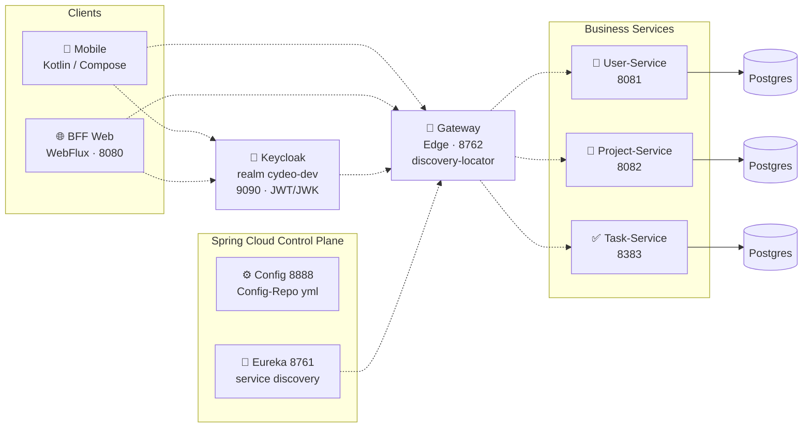
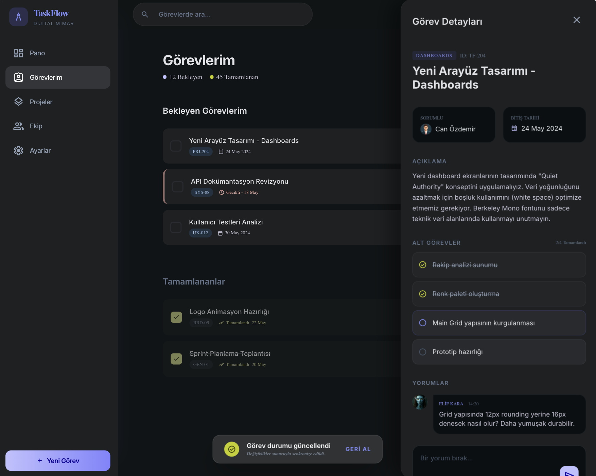
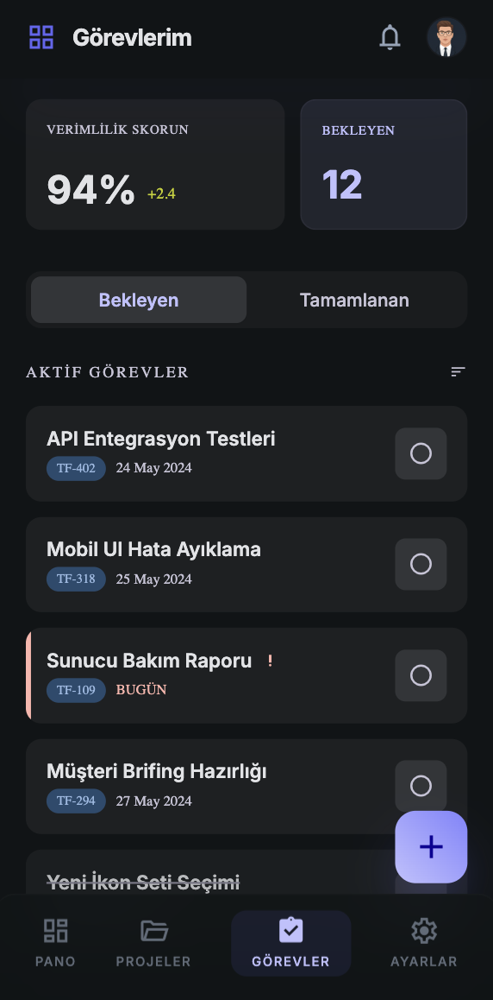

# TaskFlow — TicketinApp

A project-based task management system built with a microservices architecture. Backed by web and mobile clients, with service discovery, centralized configuration, and authentication across the whole distributed system.

This project is the microservices rewrite of my [Ticketing System — Monolithic Architecture](https://github.com/berat-erkul/ticketing-project-data) project. The goal was to split a single Spring Boot application into independently deployable services, each with its own database, while applying microservices practices such as service discovery, centralized configuration, an API Gateway, and load balancing.

## Architecture

Each service is versioned in its own GitHub repository (linked below); this repo hosts the system overview and documentation.

**Layers:**

- **Clients:** a native mobile app built with Kotlin/Compose, and a Spring WebFlux-based BFF (Backend-for-Frontend) web layer.
- **Authentication:** Keycloak handles OAuth2 with JWT/JWK; both the mobile and web clients authenticate against the same realm.
- **Edge / Gateway:** Spring Cloud Gateway routes requests dynamically to services via Eureka's `discovery-locator` — no hardcoded service addresses.
- **Control plane:** Config Server distributes centralized `.yml` configuration, Eureka handles service registration and discovery.
- **Business services:** User, Project, and Task services are fully independent, each with its own PostgreSQL database (database-per-service).

## Service Repositories

| Service | Description | Repo |
| --- | --- | --- |
| config-service | Centralized configuration server | [config-service-LAB](https://github.com/berat-erkul/config-service-LAB) |
| discovery-service | Eureka service discovery | [discovery-service-LAB](https://github.com/berat-erkul/discovery-service-LAB) |
| gateway-service | Spring Cloud Gateway (edge) | [gateway-service-LAB](https://github.com/berat-erkul/gateway-service-LAB) |
| user-service | User management | [user-service-LAB](https://github.com/berat-erkul/user-service-LAB) |
| task-service | Task management | [task-service-LAB](https://github.com/berat-erkul/task-service-LAB) |
| project-service | Project management | [project-service-LAB](https://github.com/berat-erkul/project-service-LAB) |
| web-ui-service | BFF Web (WebFlux) | [web-ui-service-LAB](https://github.com/berat-erkul/web-ui-service-LAB) |
| mobile-app | Mobile client (Kotlin/Compose) | [mobile-ticketing-app-LAB](https://github.com/berat-erkul/mobile-ticketing-app-LAB) |

## Screenshots

### Web UI

### Mobile UI

## Tech Stack

- **Backend:** Java, Spring Boot, Spring Cloud (Gateway, Eureka, Config Server, LoadBalancer)
- **Authentication:** Keycloak, JWT/JWK, OAuth2
- **Database:** PostgreSQL (one database per service)
- **Web client:** Spring WebFlux (BFF)
- **Mobile client:** Kotlin, Jetpack Compose
